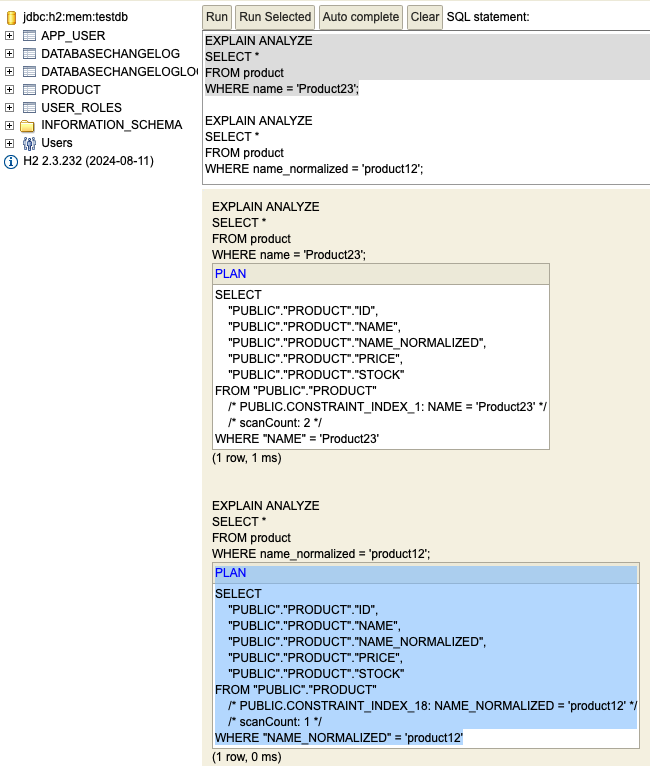

# 🛍️ Store Management API

[](https://openjdk.org/projects/jdk/21/)
[](https://spring.io/projects/spring-boot)
[](https://maven.apache.org/)
[](https://www.h2database.com/)
[](https://www.docker.com/)

A demo **Spring Boot REST API** for managing store products.
It showcases clean architecture, transactional integrity, efficient data handling, and real-world production patterns — all in a lightweight, containerized app

---

## 📥 Get the Project

Clone the repository and navigate into the project directory

```
git clone https://github.com/andrei021/store-management-api.git
cd store-management-api
```

---

## 🚀 How to Run

### 🖥️ Run Locally
#### Prerequisites: Java 21+ and Maven 3.9+ installed on your machine
```
mvn clean package
java -jar target/store-management-api-0.0.1-SNAPSHOT.jar
```

### 🐳 Run with Docker
#### Prerequisites: Make sure you have Docker installed and running on your machine
```
docker build -t store-management-api .
docker run -p 8080:8080 store-management-api
```

---

## 🗂️ API Documentation

###  Swagger

If you have already launched the application as described above (locally or through Docker), open Swagger UI for exploring the API
```declara
http://localhost:8080/swagger-ui/index.html
```

If you want to explore the API documentation without running the app, you can find the swagger yaml file at this path and import it at the link provided
```
path: docs/store-management-api.swagger.yaml
link: https://editor.swagger.io
```

---

## 🧪 Test the API
#### The application runs now on port 8080 no matter the way you launched it, locally or through Docker, and you can test it

Via Swagger UI 👉
```
http://localhost:8080/swagger-ui/index.html
```
Via Postman, the collection is ready to be imported. It can be found at this path in the project 👉
```
docs/store-management-api.postman_collection.json
```
---

## 🧱 Sample Data
- The application uses an H2 in-memory database, automatically initialized via Liquibase on startup
- The product table contains preloaded demo data used for testing and performance evaluation

#### Data characteristics:
- ID: sequential, auto-incremented from 1 to 500,000
- NAME: generated as "Product" + id (e.g., Product1, Product2, ..., Product500000)
- PRICE: randomly generated to simulate real-world values
- STOCK: all entries have a stock with a value of 1 to allow testing `InsufficientStockException` quicker
- NAME_NORMALIZED: it is not exposed to the client, used for indexed lookups
- Sample data of Product entity:
```json
{
  "id": 1,
  "name": "Product1",
  "price": 49.99,
  "stock": 1
}
```
---

## 👀 API Overview

| Role      | Endpoint                                    | Description                                         |
| --------- | ------------------------------------------- |-----------------------------------------------------|
| **User**  | `GET /api/v1/products`                      | Paginated list (params: `offset`, `limit`)          |
|           | `GET /api/v1/products/{id}`                 | Get product by ID                                   |
|           | `GET /api/v1/products/by-name?name=...`     | Search by name (case-insensitive, indexed)          |
|           | `POST /api/v1/products/buy`                 | Buy one product (stock decreases by 1)              |
| **Admin** | `POST /api/v1/admin/products/createProduct` | Create new product (does not allow duplicated names) |
|           | `PUT /api/v1/admin/products/change-price`   | Change product price               |
|           | `DELETE /api/v1/admin/products/{id}`        | Delete product by ID                                |

---

## 🧠 Tech Stack & Design Choices

| Component                             | Technology                                                            | Reason                                                                                                                                                                                                                  |
| ------------------------------------- |-----------------------------------------------------------------------|-------------------------------------------------------------------------------------------------------------------------------------------------------------------------------------------------------------------------|
| **Language**                          | Java 21                                                               | Modern LTS release with great performance and long-term support                                                                                                                                                         |
| **Framework**                         | Spring Boot 3.x                                                       | Rapid development, modularity, and production-ready defaults                                                                                                                                                            |
| **Database**                          | H2 (in-memory)                                                        | Perfect for demos and testing without external dependencies                                                                                                                                                             |
| **Persistence**                       | Spring JDBC Template                                                  | Removes ORM overhead for a small project, offers fine-grained SQL control and faster execution                                                                                                                          |
| **Database Migrations**               | Liquibase                                                             | Versioned schema management. An index on `normalized_name` ensures optimized search performance by avoiding a full table scan --> used by `findByName` endpoint                                                         |
| **Security**                          | Spring Security (Basic Auth)                                          | Simple authentication and authorization for demonstration purposes <br>Credentials: <br>🔑 `admin/admin` → Admin role <br>🔑 `user/user` → User role <br>Only Admins can access `/api/v1/admin/**` endpoints            |
| **AOP (Aspect-Oriented Programming)** | Spring AOP                                                            | Provides transaction management support and also used to log repository method execution times and preview returned data via `RepositoryMonitoringAspect`                                                                                           |
| **Transactions**                      | `@Transactional` (isolation = `REPEATABLE_READ`) with row-level locks | Prevents double-booking issues when buying a product via `buyProduct` endpoint. Ensures consistency for concurrent operations such as price changes                                                                     |
| **Pagination**                        | Offset–limit pagination                                               | Simulates UI-style pagination (like scrolling or page navigation). Typically only a few pages are requested, avoiding excessive skipped rows. For server-side batch processing, key-based pagination would be preferred |
| **Pagination Limits**                 | Default = 10, Max = 50                                                | If the client requests a higher limit, it’s automatically capped to 50                                                                                                                                                  |
| **Testing**                           | JUnit 5, Mockito, Spring Test                                         | 100% coverage on `ProductServiceImpl` + integration test for the `getProducts` --> `buyProduct` --> `check stock decreased` happy flow                                                                                  |
| **Containerization**                  | Docker                                                                | Ensures the app runs identically in any environment                                                                                                                                                                     |

---

## 📊 Performance Insights

- Inserted 500,000 products to evaluate query and pagination performance
- Added an index on `normalized_name` to enable case-insensitive, indexed lookups
- Verified via EXPLAIN ANALYZE -- the query uses an Index Scan instead of a Full Table Scan
- You can observe the difference in query execution on `PRODUCT` table: searching by `NAME_NORMALIZED` uses the index (`scanCount: 1`), whereas searching by `NAME` triggers a full table scan (`scanCount > 1`)

<p align="center">
  
</p>

---

## 🔐 Security
- Basic Authentication is enabled via Spring Security
- Role-based access control:
  - `ROLE_USER` --> can view and buy products
  - `ROLE_ADMIN` --> can view, create, update the price, and delete products
- Security-related exceptions are handled through:
  - `RestAuthenticationEntryPoint`
  - `RestAccessDeniedHandler`

---

## 🧩 Exception Handling
- Comprehensive exception management:
  - Validation errors handled with `@Valid` and `@Validated`
  - Some of the data is validated in the service layer as well, preventing errors in case it is used in other controllers
- Exceptions are handled by:
  - `GlobalExceptionHandler`
  - `ProductExceptionHandler`

## 🚠 API Response
- All API responses follow a uniform structure via StoreApiResponse
```json
{
  "data": {
    "id": 1,
    "name": "Product1",
    "price": 49.99,
    "stock": 5
  },
  "statusMessage": "SUCCESS",
  "timestamp": "2025-10-30T12:00:00Z"
}
```
- Additionally, custom Swagger annotations (`@CreateProductApiDocumentation`, `@ProductResponseApiDocumentation`, etc.) include detailed response examples for business scenarios.
  This makes the Swagger UI rich and descriptive while keeping controller logic clean

---

## 🔬 Testing Highlights
✅ Unit Tests:
`100%` coverage on `ProductServiceImpl`

✅ Integration Test -->
End-to-end happy flow covering:
- Get paginated products
- Buy a product
- Verify stock decreases by 1
